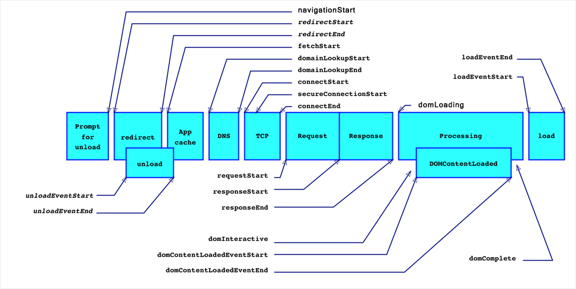

# performance API前端性能监控利器<sup>shine</sup>

> 支持浏览器: IE9+,Chrome11+,Firefox7+.

> 宿主对象window.performance.

> w3c标准草案：https://w3c.github.io/navigation-timing/#introduction

### 成员:

#### .timing
> 从输入url到用户可以使用页面的全过程时间统计，会返回一个PerformanceTiming对象，单位均为毫秒



- `navigationStart`：在同一个浏览器上下文中，前一个网页（与当前页面不一定是同域）unload 的时间戳，如果无前一个网页 unload ，则与 fetchStart 值相等
- `unloadEventStart`：前一个网页（与当前页面同域）unload 的时间戳，如果无前一个网页 unload 或者前一个网页与当前页面不同域，则值为 0
- `unloadEventEnd`：和 unloadEventStart 相对应，返回前一个网页 unload 事件绑定的回调函数执行完毕的时间戳
- `redirectStart`：第一个 HTTP 重定向发生时的时间。有跳转且是同域名内的重定向才算，否则值为 0
- `redirectEnd`：最后一个 HTTP 重定向完成时的时间。有跳转且是同域名内的重定向才算，否则值为 0
- `fetchStart`：浏览器准备好使用 HTTP 请求抓取文档的时间，这发生在检查本地缓存之前
- `domainLookupStart`：DNS 域名查询开始的时间，如果使用了本地缓存（即无 DNS 查询）或持久连接，则与 fetchStart 值相等
- `domainLookupEnd`：DNS 域名查询完成的时间，如果使用了本地缓存（即无 DNS 查询）或持久连接，则与 fetchStart 值相等
- `connectStart`：HTTP（TCP） 开始建立连接的时间，如果是持久连接，则与 fetchStart 值相等,如果在传输层发生了错误且重新建立连接，则这里显示的是新建立的连接开始的时间
- `connectEnd`：HTTP（TCP） 完成建立连接的时间（完成握手），如果是持久连接，则与 fetchStart 值相等,如果在传输层发生了错误且重新建立连接，则这里显示的是新建立的连接完成的时间

	> 注意:这里握手结束，包括安全连接建立完成、SOCKS 授权通过

- `secureConnectionStart`：HTTPS 连接开始的时间，如果不是安全连接，则值为 0
- `requestStart`：HTTP 请求读取真实文档开始的时间（完成建立连接），包括从本地读取缓存,连接错误重连时，这里显示的也是新建立连接的时间
- `responseStart`：HTTP 开始接收响应的时间（获取到第一个字节），包括从本地读取缓存
- `responseEnd`：HTTP 响应全部接收完成的时间（获取到最后一个字节），包括从本地读取缓存
- `domLoading`：开始解析渲染 DOM 树的时间，此时 Document.readyState 变为 loading，并将抛出 readystatechange 相关事件
- `domInteractive`：完成解析 DOM 树的时间，Document.readyState 变为 interactive，并将抛出 readystatechange 相关事件

	> 注意:只是 DOM 树解析完成，这时候并没有开始加载网页内的资源

- `domContentLoadedEventStart`：DOM 解析完成后，网页内资源加载开始的时间,文档发生 DOMContentLoaded事件的时间
- `domContentLoadedEventEnd`：DOM 解析完成后，网页内资源加载完成的时间（如 JS 脚本加载执行完毕），文档的DOMContentLoaded 事件的结束时间
- `domComplete`：DOM 树解析完成，且资源也准备就绪的时间，Document.readyState 变为 complete，并将抛出 readystatechange 相关事件
- `loadEventStart`：load 事件发送给文档，也即 load 回调函数开始执行的时间,如果没有绑定 load 事件，值为 0
- `loadEventEnd`：load 事件的回调函数执行完毕的时间,如果没有绑定 load 事件，值为 0

##### 常用计算：
```
setTimeout(()=>{
    let timing = performance.timing;
    console.log([
      `准备新页面时间耗时: ${timing.fetchStart - timing.navigationStart}`,
      `redirect 重定向耗时: ${timing.redirectEnd  - timing.redirectStart}`,
      `Appcache 耗时: ${timing.domainLookupStart  - timing.fetchStart}`,
      `unload 前文档耗时: ${timing.unloadEventEnd - timing.unloadEventStart}`,
      `DNS 查询耗时: ${timing.domainLookupEnd - timing.domainLookupStart}`,
      `TCP连接耗时: ${timing.connectEnd - timing.connectStart}`,
      `request请求耗时: ${timing.responseEnd - timing.requestStart}`,
      `请求完毕至DOM加载: ${timing.domInteractive - timing.responseEnd}`,
      `解释dom树耗时: ${timing.domComplete - timing.domInteractive}`, //过早获取时,domComplete有时会是0
      `白屏时间: ${timing.responseStart - timing.navigationStart}`,
      `domready时间: ${timing.domContentLoadedEventEnd - timing.navigationStart}`, //用户可操作时间节点
      `load事件耗时: ${timing.loadEventEnd - timing.loadEventStart}`,
      `onload总耗时: ${timing.loadEventEnd - timing.navigationStart}`, //过早获取时,loadEventEnd有时会是0
    ].join('\n'));
},1000);
```
#### .navigation
>旨在告诉开发者当前页面是通过什么方式导航过来的，只有两个属性：`type`，`redirectCount`

- type:标志页面导航类型,值如下表:

|type常数 |	枚举值 |	描述|
|:-------|:------:|----|
|TYPE_NAVIGATE |0 |	普通进入，包括：点击链接、在地址栏中输入 URL、表单提交、或者通过除下表中 TYPE_RELOAD 和 TYPE_BACK_FORWARD 的方式初始化脚本。|
|TYPE_RELOAD |	1 |	通过刷新进入，包括：浏览器的刷新按钮、快捷键刷新、location.reload()等方法。|
|TYPE_BACK_FORWARD |	2 |	通过操作历史记录进入，包括：浏览器的前进后退按钮、快捷键操作、history.forward()、history.back()、history.go(num)。|
|TYPE_UNDEFINED |	255 |	其他非以上类型的方式进入。|

- redirectCount:表示到达最终页面前，重定向的次数，但是这个接口有同源策略限制，即仅能检测同源的重定向。
#### .memory (chrome的一个非标准属性，内存信息)

- jsHeapSizeLimit: 内存大小限制
- totalJSHeapSize: 可使用的内存
- usedJSHeapSize: JS对象(包括V8引擎内部对象)占用的内存，不能大于totalJSHeapSize，如果大于，有可能出现了内存泄漏

## 方法

### getEntries()

获取所有资源请求的时间数据,这个函数返回一个按startTime排序的对象数组，数组成员除了会自动根据所请求资源的变化而改变以外，还可以用mark(),measure()方法自定义添加，该对象的属性中除了包含资源加载时间还有以下五个属性。

- name：资源名称，是资源的绝对路径或调用mark方法自定义的名称
- startTime:开始时间
- duration：加载时间
- entryType：资源类型，entryType类型不同数组中的对象结构也不同！具体见下
- initiatorType：谁发起的请求，具体见下

entryType的值：

|值 	|该类型对象 |	描述|
|:---|:--------|:----|
|mark |	PerformanceMark |	通过mark()方法添加到数组中的对象|
|measure |	PerformanceMeasure 	|通过measure()方法添加到数组中的对象|
|resource |	PerformanceResourceTiming |	所有资源加载时间，用处最多|
|navigation |	PerformanceNavigationTiming |	现除chrome和Opera外均不支持，导航相关信息|
|frame |	PerformanceFrameTiming |	现浏览器均未支持|
|server |	PerformanceServerTiming |	未查到相关资料|

 initiatorType的值：

|发起对象 	|值 |	描述|
|:---|:--------|:----|
|a Element |	link/script/img/iframe等 |	通过标签形式加载的资源，值是该节点名的小写形式|
|a CSS resourc |	css |	通过css样式加载的资源，比如background的url方式加载资源|
|a XMLHttpRequest object |	xmlhttprequest |	通过xhr加载的资源|
|a PerformanceNavigationTiming object |	navigation |	当对象是PerformanceNavigationTiming时返回|

```
window.addEventListener('load',()=>{
    let result = [];
    window.performance.getEntries().forEach(function (per) {
        result.push({
            'url': per.name,
            'entryType': per.entryType,
            'type': per.initiatorType,
            'duration(ms)': per.duration - per.startTime
        });
    });
    console.table(result);
},false)
```

### getEntriesByName(name,type[optional])，getEntriesByType(type)

- name：想要筛选出的资源名
- type：entryType的值中一个
> 返回值仍是一个数组，这个数组相当于getEntries()方法经过所填参数筛选后的一个子集

### setResourceTimingBufferSize(maxSize)

设置当前页面可缓存的最大资源数据个数，entryType为resource的资源数据个数。超出时，清空所有entryType为resource的资源数据。

### onresourcetimingbufferfull事件

entryType为resource的资源数量超出设置值的时候会触发该事件。

### clearResourceTimings();

该方法无参数无返回值，可以清除目前所有entryType为"resource"的数据，用于写单页应用的统计脚本非常有用。

### mark(name),measure(name, startMark, endMark),clearMarks(),clearMeasures()

用于做标记和清除标记，供用户自定义统计一些数据，比如某函数运行耗时等

- name：自定义的名称，不要和getEntries()返回的数组中其他name重复
- startMark：作为开始时间的标记名称或PerformanceTiming的一个属性
- endMark：作为结束时间的标记名称或PerformanceTiming的一个属性

创建标记：mark(name)；<br/>
记录两个标记的时间间隔：measure(name, startMark, endMark);<br/>
清除指定标记：window.performance.clearMarks(name);<br/>
清除所有标记：window.performance.clearMarks();<br/>
清除指定记录间隔数据：window.performance.clearMeasures(name);<br/>
清除所有记录间隔数据：window.performance.clearMeasures();

```
let a = performance.mark("begin");
setTimeout(()=>{
    let b = performance.mark("begin");
    performance.measure('k',a,b);
    let c = performance.getEntriesByName("k");
    console.log(c);
},100)
```

### now()

- performance.now()是当前时间与performance.timing.navigationStart的时间差，以微秒（百万分之一秒）为单位的时间，与 Date.now()-performance.timing.navigationStart的区别是不受系统程序执行阻塞的影响，因此更加精准。